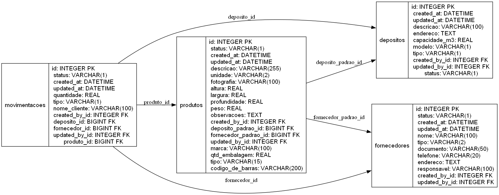

# APHONGAS

Sistema de controle de estoque para pequenas empresas de distribuição de água, gás e etc. 

## Setup

1. Instale as dependências
1. Execute a migração de dados
1. Import o backup do banco de dados
1. Execute a aplicação

## Usuários banco teste

1. admin:admin
1. gerente:1
1. colaborador:1

## Diagrama

## Funcionalidades

O sistema está dividido em Movimentação e Backoffice.

### Movimentação

* Área de controle de movimentações
* Funcionalidades limitadas
* Acesso ao catálogo de produtos
* Registro de Entrada de produto
* Registro de Saída de produto

### Backoffice

* Área de controle avançado
* Gestão de movimentação
* Gestão de produtos
* Gestão de Depositos
* Gestão de fornecedores
* Gestão de usuários

## Login
* Autenticação de usuário (*utilizar autenticação do Django)
* Verificar usuários de testes
* Permissõe definidas por Grupos
    - Administradores (super usuários)
    - Backoffice (acesso a dados para gerentes)
    - Movimentação (acesso aos dados para colaboradores)

## Obs
* Repositório no Github "Aphongas"

## Ferramentas
* Python 3 
* Django
* Bootstrap
* SQLite

## Correções
1. Corrigir a tela de Produtos do app Movimentacao para que liste a tabela de produtos. (Verifique a url do botão de adicionar produtos).

1. Adicionar a pesquisa pelo código de barra no app Movimentacao na tela Produtos. O campo Pesquisar não trás o produto correto ao informar o código de barras.

1. Adicionar a validação de quantidade de produto disponível no Registro de Saída no app Movimentacao para não registrar saída com quantidade maior que a quantidade disponível e também adicione a mesma validação na gestão de movimentações no app Backoffice (tanto na inserção quanto na alteração).

1. Crie a tela de Pesquisar Depósito no app Backoffice para que liste todos os campos do depósito e adicione também um campo de filtro de pesquisa.